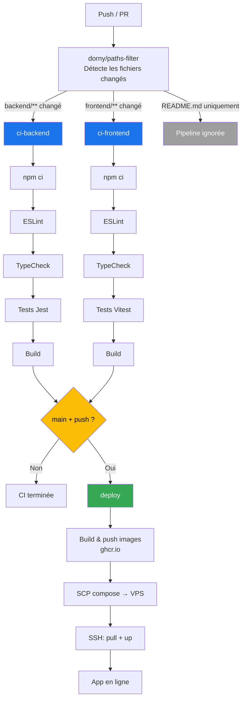

# Todo App — Full-stack avec CI/CD

Projet de to-do list complet pour le cours de CI/CD.
Application CRUD basée sur React + Express + PostgreSQL, déployée automatiquement via GitHub Actions sur un VPS Docker.

## Architecture applicative

```
┌─────────────────────────────────────────────────┐
│  VPS (Docker Compose)                           │
│                                                 │
│  ┌──────────┐  ┌──────────┐  ┌──────────────┐  │
│  │ Frontend │  │ Backend  │  │  PostgreSQL   │  │
│  │ (Nginx)  │──│ (Express)│──│  (port 5432)  │  │
│  │ port 80  │  │ port 3001│  │              │  │
│  └──────────┘  └──────────┘  └──────────────┘  │
│       │                                         │
│   http://vps-ip:8080                            │
└─────────────────────────────────────────────────┘
```

| Composant | Techno | Rôle |
|-----------|--------|------|
| Frontend | React + Vite + TypeScript | Interface utilisateur |
| Backend | Express + Prisma + TypeScript | API REST |
| Base de données | PostgreSQL 16 | Stockage persistant |
| Serveur statique | Nginx | Sert React + proxy `/api` vers le backend |
| CI/CD | GitHub Actions | Tests + build + deploy |

---

## Workflow Git

```
main ───────────────────────────────────── Merged (release)
      \                                   /
develop ──────────────── Merged (integration)
  \                      /
feature/xxx ── Developed, tested, pushed
```

| Branche | Rôle | Pipeline déclenché |
|---------|------|-------------------|
| `feature/*` | Développement d'une fonctionnalité | CI seulement (lint, tests, typecheck, build) via PR sur `develop` |
| `develop` | Intégration continue | CI seulement (lint, tests, typecheck, build) |
| `main` | Code en production | CI + CD (lint, tests, typecheck, build + images + deploy VPS) |

**Flux de travail :**

1. Créer une branche `feature/xxx` depuis `develop`
2. Développer, committer, pousser — ouvrir une PR `feature/xxx` → `develop`
3. La CI tourne sur la PR : lint, tests, typecheck, build
4. Après validation, merger la PR sur `develop`
5. Répéter pour chaque feature
6. Quand `develop` est stable, ouvrir une PR `develop` → `main`
7. La CI tourne sur la PR, le CD déploie sur le VPS au merge

**Exemple de branches dans ce projet :**

| Branche | Feature | Composants modifiés |
|---------|---------|-------------------|
| `feature/todo-count` | Compteur de tâches terminées | Frontend uniquement |
| `feature/clear-completed` | Bouton supprimer les terminées | Backend + Frontend |

---

## Architecture CI/CD



### Étapes du pipeline (4 étapes requises)

| Étape | Outil | Description |
|-------|-------|-------------|
| Build / Lint | ESLint + TypeScript | Vérifie le style du code et les types |
| Tests automatisés | Jest (backend) / Vitest (frontend) | Tests unitaires mockés sans DB réelle |
| Analyse de code | ESLint (strict mode) | Règles TypeScript strict, detection de unused vars |
| Déploiement | Docker + SSH | Build images → ghcr.io → SCP + pull sur VPS |

---

## Démarrage rapide

```bash
# Cloner le repo
git clone git@github.com:CyrilLeblanc/todo.git
cd todo

# Lancer tout avec Docker Compose
docker compose up --build

# L'app est accessible sur :
open http://localhost:8080
```

---

## Développement local (sans Docker)

```bash
# Terminal 1 — PostgreSQL
docker run -d --name todo-db \
  -e POSTGRES_USER=postgres \
  -e POSTGRES_PASSWORD=postgres \
  -e POSTGRES_DB=todoapp \
  -p 5432:5432 \
  postgres:16-alpine

# Terminal 2 — Backend
cd backend
cp .env.example .env
npm install
npx prisma db push
npm run dev                  # http://localhost:3001

# Terminal 3 — Frontend
cd frontend
npm install
npm run dev                  # http://localhost:5173 (proxy /api → :3001)
```

### Lancer les tests

```bash
cd backend && npm test        # Jest
cd frontend && npm test       # Vitest
```

---

## API Endpoints

| Méthode | Route | Description | Body |
|---------|-------|-------------|------|
| GET | `/api/todos` | Liste toutes les todos | — |
| POST | `/api/todos` | Crée une todo | `{ "title": "Ma tâche" }` |
| PATCH | `/api/todos/:id` | Toggle done/non-done | — |
| DELETE | `/api/todos/:id` | Supprime une todo | — |

---

## Configuration GitHub Actions

Aller dans **Settings → Secrets and variables → Actions** :

| Secret | Description |
|--------|-------------|
| `VPS_HOST` | IP publique du VPS |
| `VPS_USER` | Utilisateur SSH sur le VPS |
| `VPS_SSH_KEY` | Clé privée SSH (`~/.ssh/id_ed25519`) |

Les images Docker sont publiées sur **GitHub Container Registry** (ghcr.io). L'authentification se fait via `GITHUB_TOKEN` (automatique, pas de secret nécessaire). Les packages doivent être rendus publics après le premier push.

---

## Structure du projet

```
todo-app/
├── backend/
│   ├── src/
│   │   ├── index.ts              # Point d'entrée (lance le serveur)
│   │   ├── server.ts             # Express app exportée (pour tests)
│   │   └── __tests__/todos.test.ts  # Tests Jest + supertest
│   ├── prisma/schema.prisma      # Modèle Todo
│   ├── Dockerfile                # Multi-stage Node.js
│   └── package.json
├── frontend/
│   ├── src/
│   │   ├── App.tsx               # Composant principal React
│   │   ├── main.tsx              # Point d'entrée
│   │   └── __tests__/App.test.tsx  # Tests Vitest + RTL
│   ├── nginx.conf                # Proxy /api → backend
│   ├── Dockerfile                # Multi-stage (Node → Nginx)
│   └── package.json
├── docker-compose.yml            # Dev local (build from source)
├── docker-compose.prod.yml       # VPS (pull images from ghcr.io)
├── .github/workflows/ci-cd.yml    # Pipeline GitHub Actions
└── README.md
```
